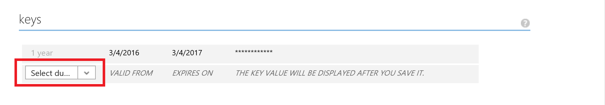
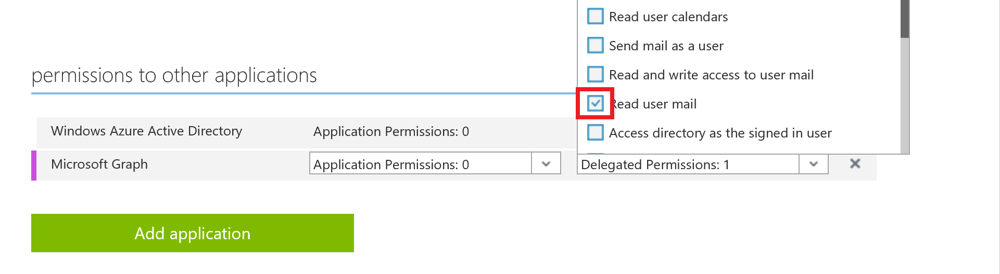

# Microsoft Graph ASP.NET Webhooks

This sample ASP.NET web application shows how to create subscriptions and receive notifications by using the Microsoft Graph [Subscription API](http://graph.microsoft.io/en-us/docs/api-reference/beta/resources/subscription). By using webhooks, you can be notified when users make changes to subscribed resources.

**Create subscriptions**

- Sign in and authenticate the user. The sample uses [OpenID Connect](https://msdn.microsoft.com/en-us/library/azure/jj573266.aspx) and [Active Directory Authentication Library .NET (v2)](http://go.microsoft.com/fwlink?LinkId=258232) to authenticate and authorize the user.
- Build the `POST /subscriptions` request. The sample subscribes to receive notifications about received emails: `Created` change type for the `me/mailFolders('Inbox')/messages` resource.
- Send the `POST /subscriptions` request to Microsoft Graph.  
- Return the validation token to Microsoft Graph.  
- Parse the subscription object, and respond with a 200 HTTP status code.

**Receive notifications**

- Parse the notification object, and respond with a 200 HTTP status code.
- React to the notification. This sample sends a GET request for the message that you were notified about. 

To learn more about Microsoft Graph webhooks, see [Subscription API](http://graph.microsoft.io/en-us/docs/api-reference/beta/resources/subscription). To learn more about using the Microsoft Graph API in an ASP.NET MVC app, see [Call Microsoft Graph in an ASP.NET MVC app](https://graph.microsoft.io/en-us/docs/platform/aspnetmvc).


## Prerequisites

To use the Microsoft Graph ASP.NET Webhooks sample, you need the following:

* Visual Studio 2015 installed on your development computer. 

* An Office 365 account. You can sign up for an [Office 365 Developer subscription](https://portal.office.com/Signup/Signup.aspx?OfferId=6881A1CB-F4EB-4db3-9F18-388898DAF510&DL=DEVELOPERPACK&ali=1#0) that includes the resources that you need to start building Office 365 apps.

>If you already have a subscription, the previous link sends you to a page with the message *Sorry, you can’t add that to your current account*. In that case use an account from your current Office 365 subscription.

* A Microsoft Azure tenant to register your application. Azure Active Directory (AAD) provides identity services that applications use for authentication and authorization. If you don't already have a tenant, you can [sign up for a trial subscription.](https://account.windowsazure.com/SignUp). 

>Important: Your Azure subscription must be bound to your Office 365 tenant. To do this, see [Manage the directory for your Office 365 subscription in Azure](https://azure.microsoft.com/en-us/documentation/articles/active-directory-manage-o365-subscription/) or [Associate your Office 365 account with Azure AD to create and manage apps](https://msdn.microsoft.com/office/office365/howto/setup-development-environment#bk_CreateAzureSubscription).

* The client ID and key from the application that you [added to your Azure tenant](https://azure.microsoft.com/en-us/documentation/articles/active-directory-integrating-applications/#adding-an-application) in the Azure Management Portal.

* A public HTTPS endpoint to receive and send HTTP requests. You can use Microsoft Azure or another service to host your endpoint. If you prefer, you can use ngrok (or similar tool) while testing to temporarily allow messages from Microsoft Graph to tunnel to a port on your local computer. [Instructions for setting up ngrok](#ngrok) are included below.


### Configure your Azure application

1. Use *https://localhost:44300* as the sign-on and reply URLs. 

2. Choose a duration in the **keys** section to generate a key. You'll be able to copy the key after you save your changes to the application.

   

2. Grant the following delegated permission to the **Microsoft Graph** application: 

   - **Read user mail** (Mail.Read)
 
   


<a name="ngrok"></a>
### Set up the ngrok proxy (optional)

You must expose a public HTTPS endpoint to create a subscription and receive notifications from Microsoft Graph. Or if you prefer, you can use ngrok while testing to temporarily allow messages from Microsoft Graph to tunnel to a port on your local computer. This makes it easier to test and debug webhooks. To learn more about using ngrok, see the [ngrok website](https://ngrok.com/).  

1. In Solution Explorer, select the **GraphWebhooks** project.

1. Copy the **URL** port number from the **Properties** window.  If the **Properties** window isn't showing, choose **View/Properties Window**. 

	

1. [Download ngrok](https://ngrok.com/download) for Windows.  

1. Unzip the package and run ngrok.exe.

1. Replace the two *<port-number>* placeholder values in the following command with the port number you copied, and then run the command in the ngrok console.

   ```
ngrok http <port-number> -host-header=localhost:<port-number>
   ```

	

1. Copy the HTTPS URL that's shown in the console. 

	

   >Keep the console open while testing. If you close it, the tunnel also closes and you'll need to generate a new URL and update the sample.


## Configure and run the sample

1. Expose a public HTTPS notification endpoint. It can run on a service such as Microsoft Azure, or you can create a proxy web server by [using ngrok](#ngrok) or a similar tool.

1. Open **GraphWebhooks.sln** in the sample files. 

1. In Solution Explorer, open the **Web.config** file in the root directory of the project.  
   a. For the **AppId** key, replace *ENTER_YOUR_CLIENT_ID* with the client ID of your registered Azure application.  
   b. For the **AppSecret** key, replace *ENTER_YOUR_SECRET* with the key of your registered Azure application.  
   d. For the **NotificationUrl** key, replace *ENTER_YOUR_ENDPOINT* with your HTTPS URL. Keep the */notification/listen* portion. If you're using ngrok, the value will look something like this:

   ```xml
<add key="ida:NotificationUrl" value="https://0f6fd138.ngrok.io/notification/listen" />
   ```

1. Make sure that the ngrok console is still running, then press F5 to build and run the solution in debug mode. 


### Use the app
 
1. Sign in with your Office 365 work or school account.


1. Choose the **Create subscription** button. The **Subscription** page loads with information about the subscripton.


1. Choose the **Watch for notifications** button.


1. Send an email to your Office 365 account. The **Notification** page displays information about the message. It may take several seconds for the page to update.


1. Choose the **Delete subscription and sign out** button. 


## Key components of the sample

The following files contain code that pertains to the main purpose of the sample: creating subscriptions and receiving notifications.

**Controllers**  
- [```NotificationController.cs```](https://github.com/OfficeDev/Microsoft-Graph-ASPNET-Webhooks/). Receives notifications.  
- [```SubscriptionContoller.cs```](https://github.com/OfficeDev/Microsoft-Graph-ASPNET-Webhooks/). Creates and receives webhooks subscriptions.
 
**Models**  
- [```Notification.cs```](https://github.com/OfficeDev/Microsoft-Graph-ASPNET-Webhooks/). Represents a change notification. 
- [```Message.cs```](https://github.com/OfficeDev/Microsoft-Graph-ASPNET-Webhooks/). Represents an Outlook mail message. 
- [```Subscription.cs```](https://github.com/OfficeDev/Microsoft-Graph-ASPNET-Webhooks/). Represents a webhooks subscription. 
- [```SubscriptionViewModel.cs```](https://github.com/OfficeDev/Microsoft-Graph-ASPNET-Webhooks/). Represents the data that displays in the Subscription views. 

**Views**  
- [```Notification/Notification.cshtml```](https://github.com/OfficeDev/Microsoft-Graph-ASPNET-Webhooks/). Displays information about received messages, and contains the **Delete subscription and sign out** button. 
- [```Subscription/CreateSubscription.cshtml```](https://github.com/OfficeDev/Microsoft-Graph-ASPNET-Webhooks/). Landing page that contains the **Create subscription** button. 
- [```Subscription/SubscriptionRequestResponse.cshtml```](https://github.com/OfficeDev/Microsoft-Graph-ASPNET-Webhooks/). Displays subscription properties, and contains the **Watch for notifications** button. 

**Other**  
- [```Web.config```](https://github.com/OfficeDev/Microsoft-Graph-ASPNET-Webhooks/). Contains values used for authentication and authorization. 
- [```Startup.Auth.cs```](https://github.com/OfficeDev/Microsoft-Graph-ASPNET-Webhooks/). Contains code used for authentication and authorization when the app starts.


## Troubleshooting

| Issue | Resolution |
|:------|:------|
| The app opens to a *Server Error in '/' Application. The resource cannot be found.* browser page. | Make sure that a CSHTML view file isn't the active tab when you run the app from Visual Studio. |


## Questions and comments

We'd love to get your feedback about the Microsoft Graph ASP.NET Webhooks sample. You can send your questions and suggestions to us in the [Issues](https://github.com/OfficeDev/Microsoft-Graph-ASPNET-Webhooks/issues) section of this repository.

Questions about Office 365 development in general should be posted to [Stack Overflow](http://stackoverflow.com/questions/tagged/Office365+API). Make sure that your questions or comments are tagged with [Office365] and [MicrosoftGraph].
  

## Additional resources

* [Microsoft Graph documentation](http://graph.microsoft.io)
* [Microsoft Graph API Reference](http://graph.microsoft.io/docs/api-reference/v1.0)


## Copyright
Copyright (c) 2016 Microsoft. All rights reserved.

