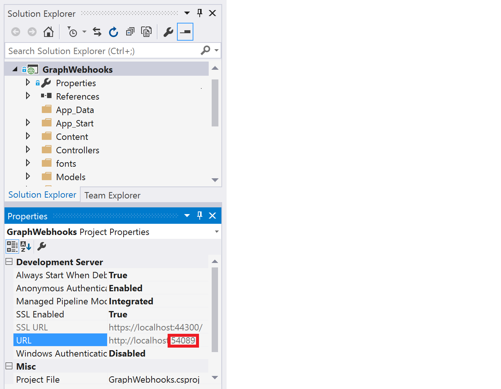

# Microsoft Graph ASP.NET Webhooks

Subscribe for webhooks to get notified when your user's data changes so you don't have to poll for changes.

This ASP.NET MVC sample shows how to start getting notifications from Microsoft Graph. The following are common tasks that a web application performs with Microsoft Graph webhooks.

* Sign-in your users with their work or school account to get an access token.
* Use the access token to create a webhook subscription.
* Send back a validation token to confirm the notification URL.
* Listen for notifications from Microsoft Graph.
* Request for more information in Microsoft Office 365 using data in the notification.
  


The previous screenshot shows the app's start page. After your app gets a subscription, your app is notified when events happen in user data. Your app can then react to the event.

This sample subscribes to the `me/mailFolders('Inbox')/messages` resource for `created` changes. It gets notified when the user receives a mail message, and then updates a page with information about the message. 

## Prerequisites

To use the Microsoft Graph ASP.NET Webhooks sample, you need the following:

* Visual Studio 2015 installed on your development computer. 

* A public HTTPS endpoint to receive and send HTTP requests. You can use Microsoft Azure or another service to host your endpoint. If you want, you can use ngrok (or a similar tool) while testing to temporarily allow messages from Microsoft Graph to tunnel to a port on your local computer. [Instructions for setting up ngrok](#ngrok) are included below.

* The client ID and key from the application that you added to a Microsoft Azure tenant. You can use the [Office 365 app registration tool](http://dev.office.com/app-registration), which simplifies the process. Use the following parameters:

   |       Parameter | Value                    |
   |----------------:|:-------------------------|
   |        App type | Web App                  |
   |     Sign on URL | https://localhost:44300/ |
   |    Redirect URI | https://localhost:44300/ |
   | App permissions | Mail.Read                |
  
   Copy and store the returned **Client ID** and **Client Secret** values.


<a name="ngrok"></a>
### Set up the ngrok proxy (optional)

You must expose a public HTTPS endpoint to create a subscription and receive notifications from Microsoft Graph. While testing, you can use ngrok to temporarily allow messages from Microsoft Graph to tunnel to a *localhost* port on your computer. To learn more about using ngrok, see the [ngrok website](https://ngrok.com/).  

1. In Solution Explorer, select the **GraphWebhooks** project.

1. Copy the **URL** port number from the **Properties** window.  If the **Properties** window isn't showing, choose **View/Properties Window**. 

	

1. [Download ngrok](https://ngrok.com/download) for Windows.  

1. Unzip the package and run ngrok.exe.

1. Replace the two *<port-number>* placeholder values in the following command with the port number you copied, and then run the command in the ngrok console.

   ```
ngrok http <port-number> -host-header=localhost:<port-number>
   ```

	

1. Copy the HTTPS URL that's shown in the console. 

	

   >Keep the console open while testing. If you close it, the tunnel also closes and you'll need to generate a new URL and update the sample.

See [Hosting without a tunnel](https://github.com/OfficeDev/Microsoft-Graph-Nodejs-Webhooks/wiki/Hosting-the-sample-without-a-tunnel) and [Why do I have to use a tunnel?](https://github.com/OfficeDev/Microsoft-Graph-Nodejs-Webhooks/wiki/Why-do-I-have-to-use-a-tunnel) for more information.


## Configure and run the sample

1. Expose a public HTTPS notification endpoint. It can run on a service such as Microsoft Azure, or you can create a proxy web server by [using ngrok](#ngrok) or a similar tool.

1. Open **GraphWebhooks.sln** in the sample files. 

1. In Solution Explorer, open the **Web.config** file in the root directory of the project.  
   a. For the **AppId** key, replace *ENTER_YOUR_CLIENT_ID* with the client ID of your registered Azure application.  
   b. For the **AppSecret** key, replace *ENTER_YOUR_SECRET* with the key of your registered Azure application.  
   d. For the **NotificationUrl** key, replace *ENTER_YOUR_URL* with your HTTPS URL. Keep the */notification/listen* portion. If you're using ngrok, the value will look something like this:

   ```xml
<add key="ida:NotificationUrl" value="https://0f6fd138.ngrok.io/notification/listen" />
   ```

1. Make sure that the ngrok console is still running, then press F5 to build and run the solution in debug mode. 


### Use the app
 
1. Sign in with your Office 365 work or school account. 

1. Choose the **Create subscription** button. The **Subscription** page loads with information about the subscription.

	
	
1. Choose the **Watch for notifications** button.

1. Send an email to your Office 365 account. The **Notification** page displays some message properties. It may take several seconds for the page to update.
   
	

1. Choose the **Delete subscription and sign out** button. 


## Key components of the sample

**Controllers**  
- [```NotificationController.cs```](https://github.com/OfficeDev/Microsoft-Graph-ASPNET-Webhooks/blob/master/GraphWebhooks/Controllers/NotificationController.cs) Receives notifications.  
- [```SubscriptionContoller.cs```](https://github.com/OfficeDev/Microsoft-Graph-ASPNET-Webhooks/blob/master/GraphWebhooks/Controllers/SubscriptionController.cs) Creates and receives webhook subscriptions.
 
**Models**  
- [```Message.cs```](https://github.com/OfficeDev/Microsoft-Graph-ASPNET-Webhooks/blob/master/GraphWebhooks/Models/Message.cs) Represents an Outlook mail message. 
- [```Notification.cs```](https://github.com/OfficeDev/Microsoft-Graph-ASPNET-Webhooks/blob/master/GraphWebhooks/Models/Notification.cs) Represents a change notification. 
- [```Subscription.cs```](https://github.com/OfficeDev/Microsoft-Graph-ASPNET-Webhooks/blob/master/GraphWebhooks/Models/Subscription.cs) Represents a webhook subscription. Also defines the **SubscriptionViewModel** that represents the data displayed in the Subscription view. 

**Views**  
- [```Notification/Notification.cshtml```](https://github.com/OfficeDev/Microsoft-Graph-ASPNET-Webhooks/blob/master/GraphWebhooks/Views/Notification/Notification.cshtml) Displays information about received messages, and contains the **Delete subscription and sign out** button. 
- [```Subscription/Index.cshtml```](https://github.com/OfficeDev/Microsoft-Graph-ASPNET-Webhooks/blob/master/GraphWebhooks/Views/Subscription/Index.cshtml) Landing page that contains the **Create subscription** button. 
- [```Subscription/Subscription.cshtml```](https://github.com/OfficeDev/Microsoft-Graph-ASPNET-Webhooks/blob/master/GraphWebhooks/Views/Subscription/Subscription.cshtml) Displays subscription properties, and contains the **Watch for notifications** button. 

**Other**  
- [```Web.config```](https://github.com/OfficeDev/Microsoft-Graph-ASPNET-Webhooks/blob/master/GraphWebhooks/Web.config) Contains values used for authentication and authorization. 
- [```Startup.Auth.cs```](https://github.com/OfficeDev/Microsoft-Graph-ASPNET-Webhooks/blob/master/GraphWebhooks/App_Start/Startup.Auth.cs) Contains code used for authentication and authorization when the app starts. The sample uses [OpenID Connect](https://msdn.microsoft.com/en-us/library/azure/dn645541.aspx) and [Active Directory Authentication Library .NET (v2)](http://go.microsoft.com/fwlink?LinkId=258232) to authenticate and authorize the user.


## Troubleshooting

| Issue | Resolution |
|:------|:------|
| The app opens to a *Server Error in '/' Application. The resource cannot be found.* browser page. | Make sure that a CSHTML view file isn't the active tab when you run the app from Visual Studio. |
| You're using ngrok and get a 'Subscription validation request timed out' response. | Make sure that you used your project's HTTP port for the tunnel (not HTTPS). |


## Questions and comments

We'd love to get your feedback about the Microsoft Graph ASP.NET Webhooks sample. You can send your questions and suggestions to us in the [Issues](https://github.com/OfficeDev/Microsoft-Graph-ASPNET-Webhooks/issues) section of this repository.

Questions about Microsoft Graph or Office 365 in general should be posted to [Stack Overflow](http://stackoverflow.com/questions/tagged/MicrosoftGraph+Office365). Make sure that your questions or comments are tagged with *[MicrosoftGraph]* and *[Office365]*.

You can suggest changes for Microsoft Graph on [GitHub](https://github.com/OfficeDev/microsoft-graph-docs).
  

## Additional resources

* [Microsoft Graph Node.js Webhooks sample](https://github.com/OfficeDev/Microsoft-Graph-Nodejs-Webhooks)
* [Microsoft Graph API Reference](http://graph.microsoft.io/docs/api-reference/v1.0)
* [Call Microsoft Graph in an ASP.NET MVC app](https://graph.microsoft.io/en-us/docs/platform/aspnetmvc)

## Copyright
Copyright (c) 2016 Microsoft. All rights reserved.

